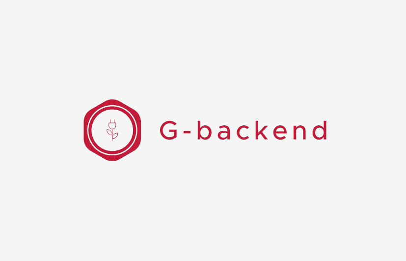

# G-backend

> a green backend for a more efficient use of resources

A lightweight backend, flexible, with no dependencies made for a low environmental footprint thanks to an integrated static page system.

|                                                                                                    summary                                                                                                    |                                                                                                 score                                                                                                 |                                                                                           to do                                                                                           |
| :-----------------------------------------------------------------------------------------------------------------------------------------------------------------------------------------------------------: | :---------------------------------------------------------------------------------------------------------------------------------------------------------------------------------------------------: | :----------------------------------------------------------------------------------------------------------------------------------------------------------------------------------------: |
|              [](https://sonarcloud.io/summary/new_code?id=fullstackbeaver_g-backend)              |  [](https://sonarcloud.io/summary/new_code?id=fullstackbeaver_g-backend)  |  [](https://sonarcloud.io/summary/new_code?id=fullstackbeaver_g-backend)  |
| [](https://sonarcloud.io/summary/new_code?id=fullstackbeaver_g-backend) | [](https://sonarcloud.io/summary/new_code?id=fullstackbeaver_g-backend) | [](https://sonarcloud.io/summary/new_code?id=fullstackbeaver_g-backend) |
|                   [](https://sonarcloud.io/summary/new_code?id=fullstackbeaver_g-backend)                   |    [](https://sonarcloud.io/summary/new_code?id=fullstackbeaver_g-backend)    |                                                                                                                                                                                            |
|        [](https://sonarcloud.io/summary/new_code?id=fullstackbeaver_g-backend)        |                                                                                                                                                                                                      |                                                                                                                                                                                            |

## Installing / Getting started

For the moment, G-backend is not available yet on npm or yarn, only on github.
In order to use it, you have to use this command line :

```shell
npm i git+https://github.com/fullstackbeaver/g-backend.git
```

## Features

G-backend provide a simple server with no dependency based only on nodejs core.

* it merge data and template : build a js page (controller), add your own model and send data to html's template page. That's it.
* as soon as a page is requested by a client, G-backend build a static copy (if you want of course you can specify it on each page) and send the copy next time this page is requested
* it handle error that you can customize
* support middlewares

## How use it ?

You have a simlpe example on [this repository](https://github.com/fullstackbeaver/gbackend-simple-demonstration)

## Roadmap

Even if it is functionnal right now, some changes should appears as soon as a front end framework will be release in order to have a full built in solution with SSR (server side render).

## Links

Even though this information can be found inside the project on machine-readable
format like in a .json file, it's good to include a summary of most useful
links to humans using your project. You can include links like:

- Project homepage: https://github.com/fullstackbeaver/g-backend
- Repository: https://github.com/fullstackbeaver/g-backend
- Issue tracker: https://github.com/fullstackbeaver/g-backend/issues
- Related videos :
  - Example of use of G-backend in a project  : [youtube&#39;s videos in french](https://www.youtube.com/playlist?list=PLu2XRk0nkrnBnbl3AQUgfzsOc8LaSaE9C)

## Licensing

The code in this project is licensed under MIT license.
